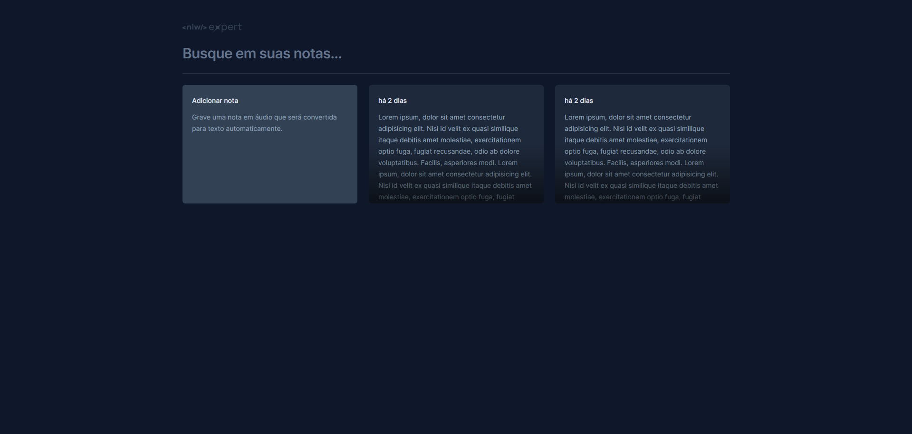
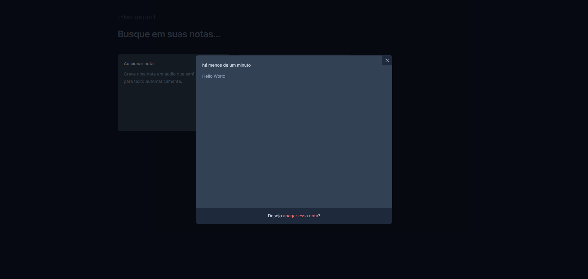
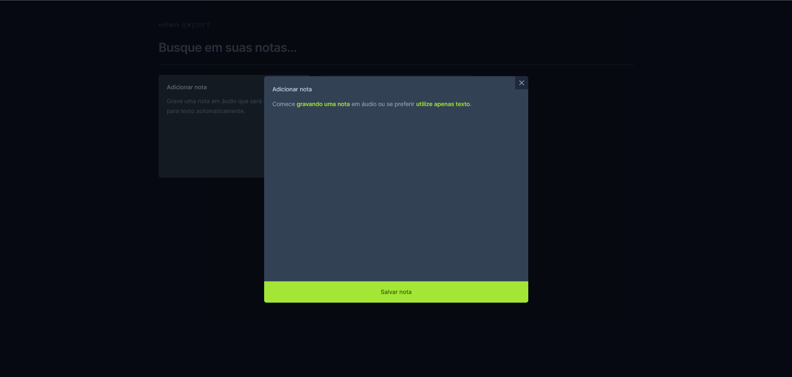
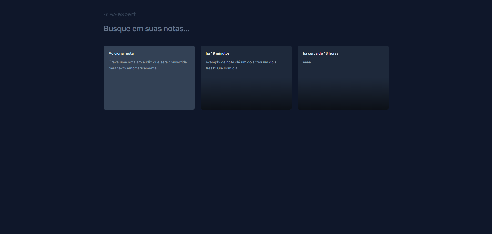
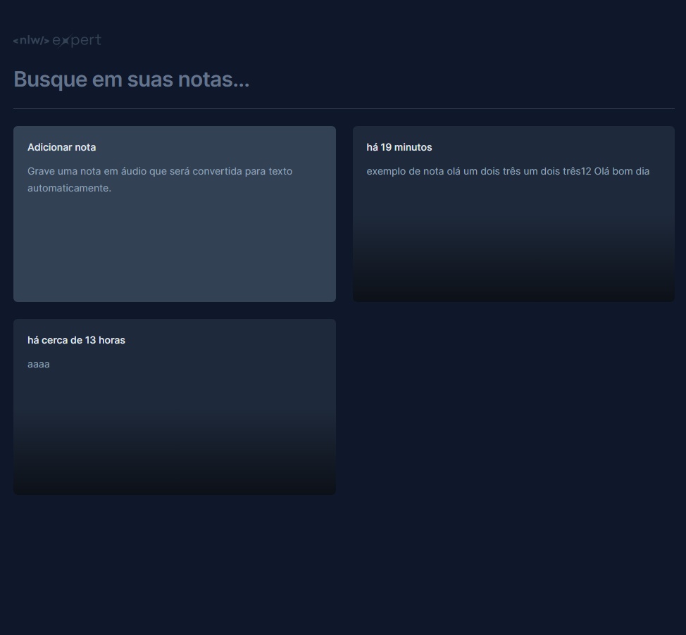
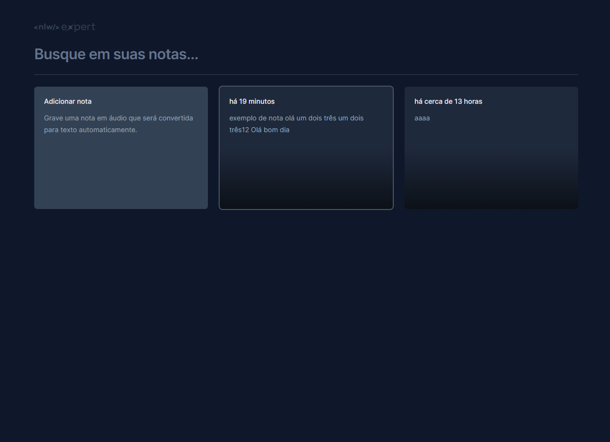
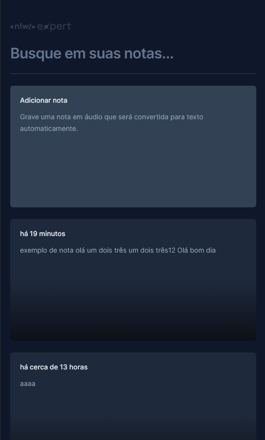

# nlw-expert-notes

Projeto feito no nlw 14 (nlw expert), utilizando react com typescript e vite, criando um site de anotações com text to speech usando api local

## Requisitos:

- Node (v18.12.0) ou superior
- npm
- vite [guia de instalação](https://vitejs.dev/guide/installation.html)
- tailwindcss [Install Tailwind CSS with Vite](https://tailwindcss.com/docs/guides/vite)
- Fonte: https://fonts.google.com/selection?query=inter
- Recomendações de extensões vscode:
  - Tailwind CSS intelliSense
  - opcional: PostCSS Language support
  - opicional: console ninja (para ver os console.logs no código)
- Radix dialog(implementações de funcionalidades como dialog e facilitações pré implementadas de acessibilidade): [Dialog documentation and installation](https://www.radix-ui.com/docs/primitives/components/dialog)
- date-fns(para manipulação de datas): `npm i date-fns`
- lucide-react(pacote de icones): `npm i lucide-react`
- sonner (pacote de notificações): `npm i sonner`

## Anotações e resultados das aulas:

### Aula 1:

[anotações da aula 1](class_notes/class_1/class-1.md)  
resultado aula 1:

### Aula 2:

[anotações da aula 2](class_notes/class_2/class-2.md)  
resultados aula 2:

### Aula 3:

[anotações da aula 3](class_notes/class_3/class-3.md)  
Resultados:

