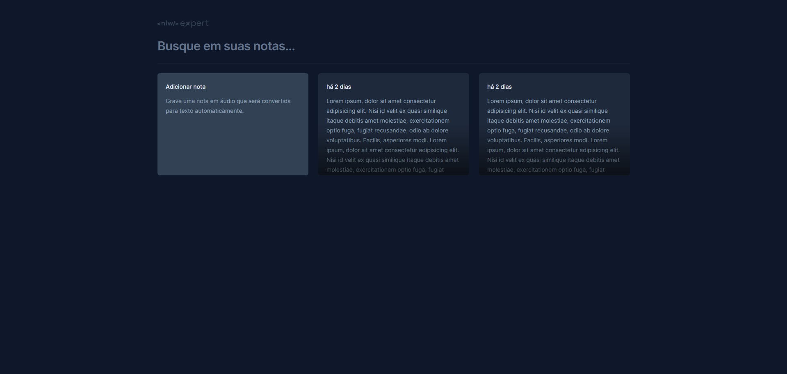

# nlw-expert-notes

Projeto feito no nlw 14 (nlw expert), utilizando react com typescript e vite, criando um site de anotações com text to speech usando api local

## Requisitos:

- Node (v18.12.0) ou superior
- npm
- vite [guia de instalação](https://vitejs.dev/guide/installation.html)
- tailwindcss [Install Tailwind CSS with Vite](https://tailwindcss.com/docs/guides/vite)

## Minhas anotações da Aula 1:

[anotações da aula 1](class_notes/class-1.md)
resultado aula 1:

