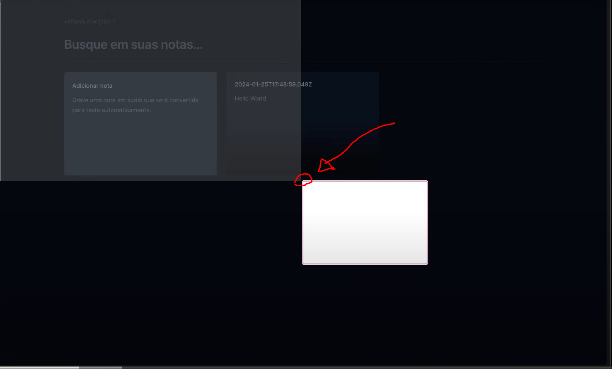
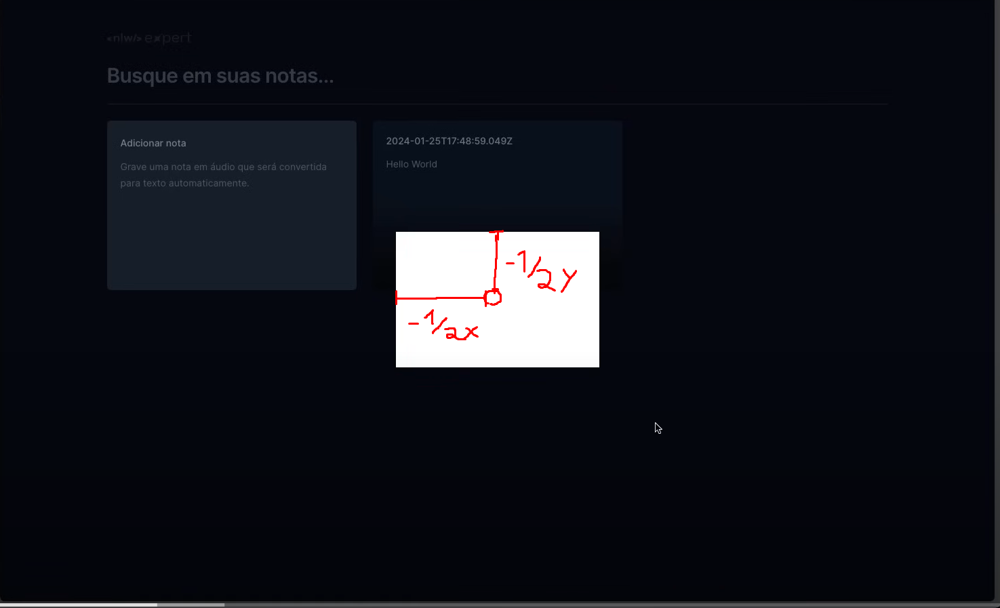
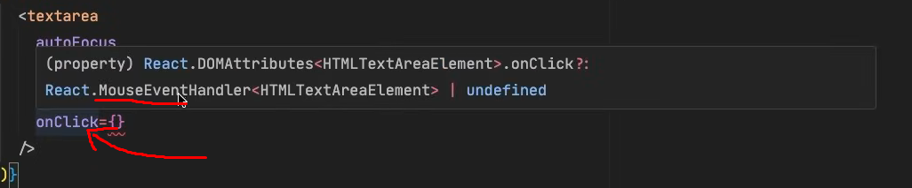
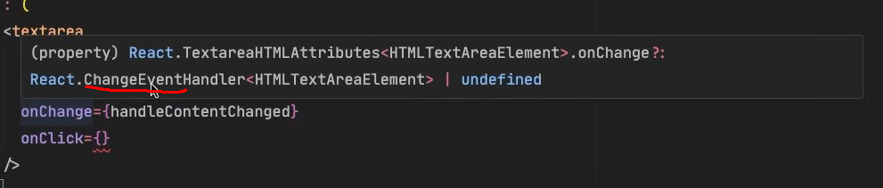

# Anotações Aula 2

## conceitos apresentados do React

- Forms e inserção de dados
- Hooks
- Renderização condicional
- Renderização de listas
- Parametrização(adição de propriedades/params) de componentes
- Estados

### Parametrização de componentes react com ts

- Primeiro cria-se um type ou uma interface de dados

### Notas gerais:

- Foi substituido o space-y-3 por: flex flex-col gap-3; Provavelmente por causa do button que envolve o card e coloca as coisas centralizadas
  - Solução alternativa(mais complicada): utlizar position:absolute e set top:10 e left: 10, para todos os elementos filhos do button; OBS: o button tem que ter position relative para funcionar
- Instalação do radix no projeto.
  - Motivação, usar o radix cria funcionalidades visuais sem aplicar estilo próprio(css) o que permite um desenvolvimento mais flexível e personalizável
  - Instalado com [radix Dialog](https://www.radix-ui.com/primitives/docs/components/dialog)
    - `npm install @radix-ui/react-dialog`
- Importações do js com alias ex:
  - `import * as Dialog from '@radix-ui/react-dialog';`
  - Coloca tudo que tem dentro do @radix-ui/react-dialog em uma variável/objeto com o alias de Dialog, podendo acessar seus valores com: Dialog. EX: `Dialog.Root`, facilitando o entendimento do que o elemento Root é.
- O dialog root é a raiz do modal e o dialog trigger é o que engatilha a aparição do modal, O dialog content é o conteúdo que aparece ao ser apertado o trigger e o Dialog portal é o que faz com que seja criado um novo elemento acima da div hoot que se colocado ao redor do content faz ele aparecer como um overlay
- Para colocar uma nova div no centro da tela com tailwind temos: `<div className="fixed top-1/2 left-1/2 -translate-x-1/2 -translate-y-1/2">`
  - o porque do -translate-y-1/2 e -translate-x-1/2, por que ao colocar o ponto de começo sendo metade da largura e da altura o elemento começa na sua âncora superior esqueda desse ponto ficando:
    - 
  - Ao colocarmos os novos translates com - no começo para inverter sua orientação, realinhamos os seus eixos para o centro real do elemento, ficando:
    - 
- OBS: Elementos de padding, margin e position podem ter - antes para inverter a sua orientação
- Para valores forçados do tailwindo com: `max-w-[640px]` é obrigatório colocar o px depois, caso contrário o valor é ignorado
- Instalar o date-fns para facilitar a manipulação de datas no JavaScript
- Quando você quer que uma tag filha do jsx tenha um efeito hover vindo do pai você pode usar o group do tailwind e aplicar o group-hober para o elemento filho, assim ativando quando o hover for feito no elemento pai ex:

```jsx
<button
  type="button"
  className="w-full bg-slate-800 py-4 text-center text-sm
            text-slate-300 outline-none font-medium group"
>
  Deseja{' '}
  <span className="text-red-400 group-hover:underline">apagar essa nota</span>?
</button>
```

- A classe "size" do tailwind seta tanto a largura quanto a altura EX: `size-5`
- Dica para saber o tipo de um evento do html(basta pegar o nome até o Handler):
  - 
  - 
- Para pegar o valor tem que adicionar o generic de:
  - ChangeEvent<HTMLTextAreaElement>ouChangeEvent<HTMLButtonElement>
- Para fazer o autofocus temos: `autoFocus` no textarea
- Para prevenir o comportamento padrao do submit do form, temos: `event.preventDefault()`, cancelando seu comportamento padrao de recarregamento da pagina
- Adicionar o rich colors no Toaster no index.tsx faz com que os toasts fiquem mais coloridos e chamativos, ao invés de preto e branco
